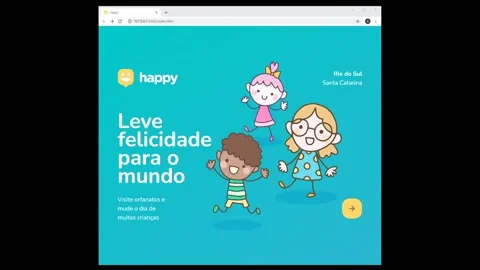
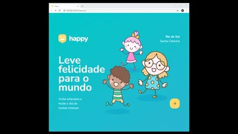
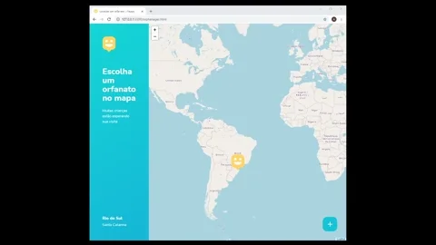
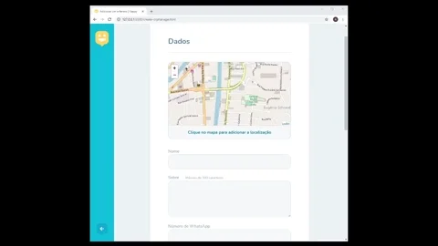
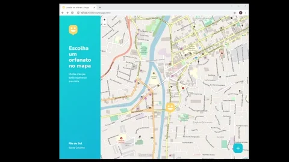
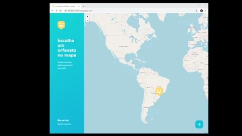

<!---------- Title/ Logo -------------->
<h1 align="center">
    
</h1>

 <!-- ------- Ancoras --------------->
<p align="center">
  <a href="#-sobre">Sobre</a>&nbsp;&nbsp;&nbsp;|&nbsp;&nbsp;&nbsp;
  <a href="#-projeto">Projeto</a>&nbsp;&nbsp;&nbsp;|&nbsp;&nbsp;&nbsp;
  <a href="#-telas">Telas</a>&nbsp;&nbsp;&nbsp;|&nbsp;&nbsp;&nbsp;
  <a href="#-tecnologias">Tecnologias</a>&nbsp;&nbsp;&nbsp;|&nbsp;&nbsp;&nbsp;
  <a href="#-licença">Licença</a>
</p>

<!---------- Badges ----------------->  
<p align="center">
  

  

  

  
  <!----(4953b8)--BluePurple -->
  <!----(49AA26)--Green -->
  <!----(008ed6)--Blue -->
  <!----(3292a6)--BlueMedium--> 
  <!----(15C3D6)--BlueLight--> 
</p>
<br>
<!---------- showcase  ----------------->  
<p align="center">
  
</p>

<!----- Acess Deploy Demonstration-->
 <h5 align="center">
    🎬 Clique Aqui: &nbsp; <a href="https://loop-lab.vercel.app/">  Visualizar Demonstração </a> 
 </h5>

<!-- # Indice
- [Sobre](#-Sobre)
- [Projeto](#-Projeto)
- [Layout](#-Layout)
- [Desafio](#-Desafio) 
- [Licença](#-licença)
- [Instruções](#-Instruçoes)
- [Tecnologias Utilizadas](#-Tecnologias-Utilizadas)
- [Como Baixar o Projeto](#-Como-Baixar-o-Projeto) -->

<!----- Description ------------------>

## 🔖 Sobre
 &nbsp;&nbsp;&nbsp;&nbsp;Este Projeto faz parte de um evento do qual tive a oportunidade de participar, onde foi sugerido a **NLW3**, neste pude aprender mais sobre as seguintes técnologias e partilhar conhecimentos com diversos outros desenvolvedores com objetivo principal de criação deste sistema. &nbsp;&nbsp;O **Happy** é uma aplicação Web e Mobile que possibilita aos usuários cadastrar e encontrar orfanatos. Aos usuários de visitação, é oferecido detalhes do orfanato, como horários e instruções para a visitação do orfanato.

<br>

## 💻 Projeto

&nbsp;&nbsp;&nbsp;&nbsp;O Happy é uma aplicação que conecta pessoas à casas de acolhimento institucional para fazer o dia de muitas crianças mais feliz 💜

&nbsp;&nbsp;&nbsp;&nbsp;Este projeto foi idealizado pensando no dia **12 de outubro**, onde é celebrado o **Dia das Crianças**, criado com o intuito de ajudar os usuários a encontrar orfanatos e trazer alegria as crianças.

<br>

###### **Evento :** Next Level Week 3ª Edição - [Rocketseat](https://rocketseat.com.br)
###### **Instrutor :** Mayk Brito

<br>

<!----- Showcase Screens Shot------------------>

## 💻  **Telas**

<div align="center">






</div>
<br>
<br>

<!----- Configurations ---------------------------->

## 🔖 Layout

&nbsp;&nbsp;&nbsp;&nbsp;Nos links abaixo você encontra o layout do projeto web e também do mobile. Lembrando que você precisa ter uma conta no [Figma](http://figma.com/) para acessá-lo.

- [Layout Web](https://www.figma.com/file/mDEbnoojksG4w8sOxmudh3/Happy-Web)
- [Layout Mobile](https://www.figma.com/file/X27FfVxAgy9f5IFa7ONlph/Happy-Mobile)

<br>

## 🧠 Desafio

&nbsp;&nbsp;&nbsp;&nbsp;No link a seguir você encontra o guia no Notion referente aos desafios propostos para que você possa percorrer a milha extra e incrementar ainda mais essa aplicação. Lá também você encontra um guia mostrando todo o passo a passo de como realizar o deploy tanto do backend quanto do frontend.

- [Desafio Happy 2.0](https://www.notion.so/Vers-o-2-0-do-Happy-c754db7a4d41469e8c2d00fcf75392c4)

<br>

## 📝 Licença

&nbsp;&nbsp;&nbsp;&nbsp;Esse projeto está sob a licença MIT. Veja o arquivo [LICENSE](LICENSE.md) para mais detalhes.

<br>

## 🚀 Tecnologias utilizadas

- [HTML5](https://pt.wikipedia.org/wiki/HTML5) - Hyper Text Markup Language -linguagem de marcação de hipertexto.
- [CSS3](https://pt.wikipedia.org/wiki/CSS3) - Cascading Style Sheets - estilização de código html.
- [Java Script](https://www.javascript.com/) -  Linguagem de programação utilizada em páginas web. Com o JS.
- [Node.js](https://nodejs.org/en/) - Ambiente de execução Javascript server-side.
- [VS Code](https://code.visualstudio.com/) - Editor de desenvolvimento de aplicações web.

<br>

## 📌 Instruções : 
&nbsp;&nbsp;&nbsp;&nbsp;Para iniciar o Servidor da aplicação use o comando: **_npm run dev_** então acesse pelo navegador **_http://127.0.0.1:5500/_** 
### ❔ Como Usar a Aplicação

#### **Pré-requisitos**

- É **necessário** possuir o **[Node.js](https://nodejs.org/en/)** instalado no computador.
- É **necessário** possuir o **[Git](https://git-scm.com/)** instalado e configurado no computador.
- É **necessário** possuir um gerenciador de pacotes, **[Yarn](https://yarnpkg.com/)** ou **[NPM](https://www.npmjs.com/)**.
- É **necessário** ter o **[Expo](https://expo.io/)** instalado de forma global na máquina.

###   Passo 1️⃣ : Clonando o Projeto na sua máquina:

##### Abra seu terminal, escolha um lugar para clonar o repositório e execute:

```sh
# Clonar o repósitorio
  $ git clone https://github.com/alxlima/Happy.git
```

### Passo 2️⃣ : Configurando o Projeto:

##### Nas pastas **Server** e **Web** execute:

```sh
# Instalar dependencias
 npm install
```

##### Com isso, dependências do projeto serão instaladas.

##### Na pasta **Server** voce irá precisar criar as **migrations**, execute:

```sh
# Iniciar migração 
 yarn typeorm migration:run
```

### Passo 3️⃣ : Executando a aplicação.

##### Para executar a aplicação **Web** e **Mobile** utilize:

```sh
# Iniciar execução
 npm start
```

Para executar o **Server**, utilize:

```sh
# Para iniciar o Servidor da aplicação
 npm run dev
```

## 📁 Como Baixar o Projeto
```bash
  # Clonar o repósitorio
  $ git clone https://github.com/alxlima/Happy.git
  
  # Entrar no diretório
  $ cd c:/nlw

  # Instalar as dependências
  $ npm install
  
  # Iniciar o Projeto
  $ npm start
```
---
 Desenvolvido 🚀 por: ***_Alex Sandro da Silva lima_***
 
[](https://www.linkedin.com/in/alex-sandro-da-silva-lima-8b297839/) 
[](mailto:alex_lima2013@hotmail.com)
